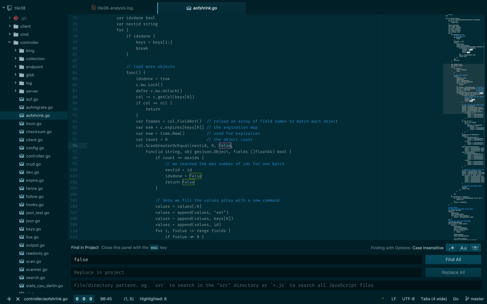

# minimus-dark-syntax theme

Combines what I consider to the best of no-syntax-highlighting-syntax package (removing highlighting except for comments) and solarized (for color familiarity and coordination), in a dark variant.

